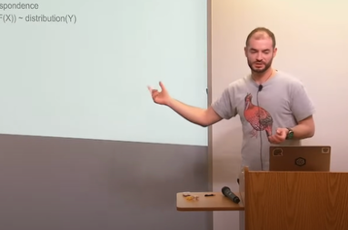
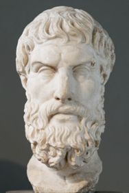
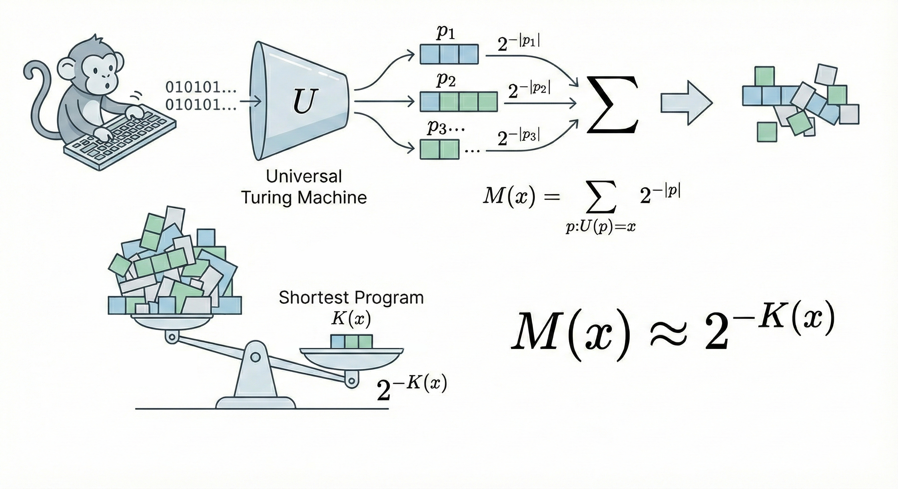
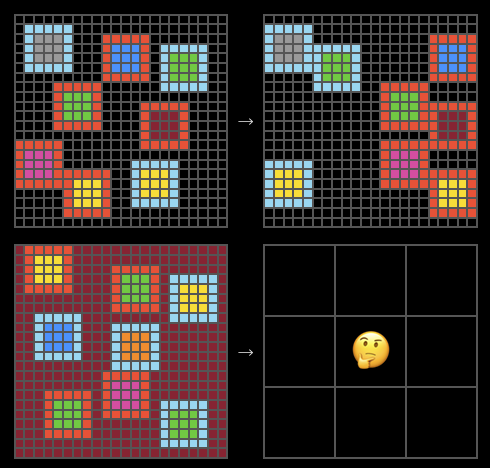
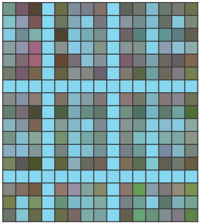

The time is late 2025. "Artificial General Intelligence" (AGI), once viewed as a distant sci-fi concept, is no longer empty talk; it has become a weighty reality resting on everyone's desk.

In this era, we witness two starkly contrasting emotions. On one side, there is profound anxiety and restraint. Turing Award winner Geoffrey Hinton has expressed deep fear regarding AGI, even admitting regret over his life's work, worrying that out-of-control intelligence could destroy humanity. Meanwhile, the legendary Ilya Sutskever, in pursuit of fundamental safety, resolutely founded SSI (Safe Superintelligence), embarking on a solitary path to build a superintelligence that is safe and controllable at its core. On the other side lies the fervent Effective Accelerationism (e/acc). They chant "accelerate," advocating for the advancement of the technological singularity at all costs, firmly believing that the exponential explosion of computing power and intelligence is the ultimate cure for all human maladies, and that any deceleration is a crime against civilization.

However, beneath these clamorous discussions about compute wars, safety controls, and social ethics, the field of artificial intelligence has always harbored a "hidden thread" (a faint trail of clues). This thread existed as early as 40 years ago. It has nothing to do with current GPU clusters, nor does it discuss the layer count of Transformers; instead, it uses the purest mathematical language to define the essence of "intelligence."

This hidden thread begins with Turing, is formed by Kolmogorov, and converges into a beacon in the hands of Ray Solomonoff. Today, let us temporarily withdraw from the noise of 2025, trace back along Ilya Sutskever's famous phrase "compression is intelligence," and rediscover that mathematical treasure forgotten by modern AI—**Solomonoff Induction**.

## I. The Essence of Intelligence: From Compression to Prediction

### Compression = Finding Patterns
Let us first return to the legendary Ilya Sutskever. In a 2023 lecture, Ilya threw out a view that caused a sensation at the time: "Intelligence is compression."

This idea sounds surprisingly simple, but it contains profound logic: to compress large-scale language data, or any form of data, you must find the patterns contained within it. The more accurately and simply you find these patterns, the more extremely you can compress the data. The process of "finding patterns" is precisely the process of modeling.

We can imagine a deterministic world where the task of a Large Language Model (LLM) is to predict the next token as accurately as possible. If, in this world, the "next token" has absolutely no randomness, then a perfect model can not only accurately predict the future but also perfectly compress the past—you only need to provide a very short prompt, and the model can use the patterns it has mastered to precisely reconstruct the entire article.

In fact, as early as 2016, the prototype of this thought had already sprouted within OpenAI. But what many don't know is that if we continue to trace upstream from the concept of "compression is intelligence," we will find that it connects to the three patriarchs of Algorithmic Information Theory: Hutter's $AI\xi$, Solomonoff's Universal Induction, and the famous Kolmogorov.

### Time Series: The Unified View of Everything
To truly understand this theory, we need to break the traditional boundary between "training" and "inference" in machine learning. In biological intelligence, observation, learning, and prediction are streams interwoven together. To describe this process, we must introduce time $t$ and construct a unified image: all intelligent activities are essentially based on past observations $x_{1:t}$ to predict the next moment $x_{t+1}$.

In this framework, $x_{1:t}$ is all of our "experience." The form of this $x_t$ is extremely flexible: it can be a string of numbers, in which case you are doing time series forecasting; it can be a pixel stream of an image, in which case you are doing generative modeling; it can even be a sequence of "image-label" pairs, where given image $x_t$, you predict label $x_{t+1}$, in which case you are doing a classification task.

Thus, this abstract time-series perspective actually encompasses the myriad methods of machine learning. The core of all tasks boils down to a conditional probability:
$$
p(x_{t+1} \mid x_{1:t}) = \frac{p(x_{1:t+1})}{p(x_{1:t})}
$$
This formula tells us that to predict the future ($x_{t+1}$), is essentially equivalent to being able to assess the probability of the entire sequence ($x_{1:t+1}$) occurring. In other words, whoever can most accurately calculate the **prior probability** of a piece of data appearing holds the key to predicting the future.

### The Game of Occam and Epicurus
Since the goal is clear, how should we predict? Let's play a simple "find the pattern" game. Suppose there is such a string of numbers:
$$
1, 0, 1, 0, 0, 1, 0, 0, 0, 1, \dots
$$
How do you predict the next number? Faced with this problem, human intuition often splits into three philosophical attitudes:

1.  **Occam's Razor:** This is the first choice of human intuition. You will keenly discover the simple rule that "the number of 0s between two 1s increases by one each time." According to this rule, the next should be four 0s, then a 1. We prefer it because it is simple.
2.  **Agnosticism (or Conspiracy Theory):** You could argue that this string of numbers is just a fragment taken from a larger, completely different sequence. Perhaps after the next number, the pattern will mutate and become all 1s. Although this sounds awkward, strictly speaking, you cannot logically falsify it before the data appears.
3.  **Pure Randomness:** Perhaps this is a completely random string of numbers, and the previous pattern is purely coincidental, just like seeing a cloud that looks like a sheep—it is merely our illusion.

This leads to the ancient Greek philosopher Epicurus's **"Principle of Multiple Explanations"**: "If more than one theory is consistent with the data, keep them all." This means that although we prefer simple explanations (Occam), we cannot arbitrarily discard other complex possibilities unless new evidence thoroughly negates them.

This seems to be a dilemma: Occam's Razor asks us to choose only the simplest, while Epicurus asks us to keep all of them. How can we unify the two?

> "Those who insist on only one explanation are in conflict with the facts." — Diogenes Laertius, *Lives of Eminent Philosophers*, Book X - Letter to Pythocles - Epicurus

Solomonoff Induction is precisely the perfect marriage of these two seemingly contradictory principles in mathematics.

## II. The Oracle of Mathematics: From Algorithmic Probability to Universal Induction

To understand Solomonoff's greatness, we cannot simply think of him as a translator who turns philosophy into formulas. Quite the opposite, he was an explorer. He attempted to answer a most fundamental question: **In this universe, what exactly is the prior probability of a piece of data $x$ appearing?**

If we can accurately calculate this prior probability (denoted as $M(x)$), according to Bayes' theorem, we can perfectly predict the future. Ray Solomonoff did not design a formula out of thin air; instead, starting from a thought experiment, he derived that astonishing conclusion.

### Algorithmic Probability $M$: The Mathematical Truth of Monkeys and Typewriters
Let us imagine that famous scene: a monkey randomly typing on a keyboard. But in Solomonoff's version, the monkey is not typing poetry, but binary code, input into a universal Turing machine.

If we make no assumptions, the only truth we know is: **Program generation obeys a random process.** For mathematical rigor, we need to introduce the concept of **Prefix-free Code** (meaning the machine stops executing once it reads a complete code and will not read it as a prefix of another code). If the monkey randomly and independently hits 0 or 1, then the probability of a specific program of length $|p|$ being typed out is precisely equal to $2^{-|p|}$.

Now, we ask: What is the probability that the program typed by this monkey, after running, outputs exactly the data $x$?

Obviously, this is the sum of the probabilities of all programs capable of outputting $x$. We call this **Algorithmic Probability**, denoted as $M(x)$:
$$
M(x) = \sum_{p:U(p)=x} 2^{-|p|}
$$
Here appears a result that is not human-designed but a mathematical inevitability: because this is a summation of negative powers of 2, the total value will be dominated by the *shortest* program.

This introduces **Kolmogorov Complexity $K(x)$**—which is the length of the shortest program that outputs $x$.
$$
K(x) := \min_{p} \{ |p| : U(p) = x \}
$$
For example, suppose the shortest program length generating data $x$ is 100 bits, and the next shortest is 200 bits. $2^{-100}$ is $2^{100}$ times larger than $2^{-200}$! Those verbose, complex programs contribute negligibly to the total probability.

Therefore, we get a shocking approximation:
$$
M(x) \approx 2^{-K(x)}
$$
This is the true source of Occam's Razor. Occam's Razor is not a subjective preference invented by humans to save trouble; it is a physical law of the algorithmic world: the simpler the thing ($K$ is small), the greater the probability ($M$) that it is generated by algorithmic randomness.

**Simplicity is truth. It is not philosophy; it is mathematics.**

### Solomonoff Induction $\xi$: The Perfect Prediction Machine
Since $M(x)$ gives us the prior probability of data, Solomonoff went with the flow and transformed it into a prediction model.

He conceived an ultimate predictor $\xi$. Since we don't know which law is actually at work behind the data, let's take all possible, computable probability distributions and form a set $\mathcal{M}$. Every $\nu \in \mathcal{M}$ is a "theory" or "hypothesis" explaining the data.

So, how do we assign weights to these theories? Solomonoff didn't need to reinvent the wheel; he directly borrowed the conclusion of $M(x)$: the prior probability of a theory $\nu$ (which is essentially a program) existing in the universe is proportional to $2^{-K(\nu)}$.

Thus, **Solomonoff Induction** was born:
$$
\xi_U(x_{1:t}) = \sum_{\nu \in \mathcal{M}} w_\nu \nu(x_{1:t}), \quad \text{where } w_\nu = 2^{-K(\nu)}
$$
Now, we can clearly see that this formula is not a patchwork, but an inevitability of logic:

* **Summation ($\sum$) — Epicurus's Persistence:** This corresponds to "summing over all possible programs" in algorithmic probability. We do not discard a theory just because it looks strange; we keep all possibilities.
* **Weight ($2^{-K}$) — Occam's Victory:** This is not an artificially set preference but stems from the algorithmic probability derived above. Complex theories are naturally assigned extremely low weights because their description programs are long.
* **Bayesian Update:** With the accumulation of data $x_{1:t}$, $\xi$ will automatically filter. Those theories $\nu$ that predict incorrectly, their probability term $\nu(x_{1:t})$ will rapidly go to zero; while those theories that are **both simple ($2^{-K}$ is large) and accurate ($\nu(x)$ is high)** will dominate the summation.

### Universal Induction: The Inevitability of Convergence
The most powerful aspect of $\xi$ lies in its universality and convergence. It can be said that $\xi$ and $M$ arrive at the same destination mathematically ($M(x) \overset{\times}{=} \xi(x)$). This means $\xi$ inherits all the properties of algorithmic probability. Mathematicians have proven an extremely important convergence theorem:

Assuming the true distribution of the environment is $\mu$ (as long as it is computable), then with the increase of observed data, the prediction result of Solomonoff Induction $\xi$ will converge to the true distribution $\mu$ at an extremely fast speed.
$$
\sum_{t=1}^{\infty} \mathbb{E} \left[ \sum_{x_t} \left( \xi(x_t|x_{<t}) - \mu(x_t|x_{<t}) \right)^2 \right] \le K(\mu) \ln 2 + \mathcal{O}(1)
$$
This inequality tells us: the total error of prediction has an upper limit, and this upper limit depends only on the complexity of the environment itself, $K(\mu)$.

This means that Solomonoff Induction is theoretically the optimal learning machine. It doesn't require us to agonize over neural network architectures or hyperparameters; as long as we give it enough data, it automatically finds the "true generating program" hidden behind the data, whether this program is Newtonian mechanics, General Relativity, or a set of physical laws we won't discover until the year 3000.

This is **Universal Induction**. It unifies inductive inference, model selection, and Bayesian statistics, becoming the ultimate mathematical definition of intelligence.

## III. The Reflection of Reality: AIXI, Large Models, and the End of Science

Although $\xi_U$ and $K(x)$ contain incomputable components—like the perfect archetypes in Plato's world of ideas, unable to be built directly in the physical world—if we observe the AI progress of 2025, we find that many breakthrough technologies are actually projections of this theory on the walls of the reality cave.

### The Ultimate Agent AIXI: From Prediction to Decision
Having mastered the perfect prediction tool $\xi_U$, we are only one step away from AGI: **Decision Making**.

If we add a goal (Reward) to $\xi$, the theoretically strongest universal reinforcement learning agent is born—**AIXI**. Its decision formula is as follows:
$$
y_t := \arg\max_{y_t} \sum_{x_t} \dots \max_{y_n} \sum_{x_n} [r_t + \dots + r_n] M(x_{1:n} \mid y_{1:n})
$$
This formula describes AIXI's thinking process: it uses the universal distribution $M$ to simulate all possible future observation branches, predicts how the environment will feed back under different action sequences, and then selects the action that maximizes the expected value of future cumulative rewards. AIXI is the mathematical upper limit of intelligence; it tells us: **Intelligence = Powerful Compression/Prediction Model + Reward Maximization Strategy.**

### Compression is Learning: The Essence of ARC-AGI and VAE

In reality, we cannot calculate $K(x)$, but we are constantly looking for its approximate solutions.

The ARC-AGI test proposed by Keras creator François Chollet has become the touchstone for testing whether AI possesses "universality" due to its extremely small sample size and extremely high reasoning difficulty. Traditional deep learning relies on massive data and is often helpless in the face of ARC. However, methods based on the "compression" idea have sprung up.

To understand this breakthrough, we need to trace back to the unified perspective of "time series" mentioned at the beginning.

In the ARC task, we usually have several pairs of examples (input $x$ and output $y$), and a new test input $x_n$, with the goal of predicting $y_n$. If we view this process as a sequence flowing through time, then the current "historical data" is:
$$
D = (x_1, y_1, x_2, y_2, \dots, x_{n-1}, y_{n-1}, x_n)
$$
Our task is essentially to predict the next element $y_n$ of the sequence.

Using the framework of Solomonoff Induction, to predict $y_n$, we are actually looking for a theory $\nu^*$ that best generates the current historical sequence $D$. According to the formula derived earlier, the optimal theory $\nu^*$ must satisfy two conditions simultaneously: strong explanatory power (high probability) and sufficient simplicity (low complexity). We apply the formula of $\xi_U$, but for simplicity, we only look for that single optimal $\nu^*$:
$$
\nu^* = \arg\max_\nu \underbrace{2^{-K(\nu)}}{\text{Simplicity}} \cdot \underbrace{\nu(D)}{\text{Explanatory Power}}
$$
To facilitate calculation, we take the negative logarithm of both sides. The original "maximize probability" problem instantly becomes a familiar "minimize loss" problem:
$$
\text{Loss} = \underbrace{-\log_2 \nu(D)}{\text{Reconstruction Error}} + \underbrace{K(\nu)}{\text{Model Complexity}}
$$
Look! This is not just a mathematical transformation; this is the manifestation of physical meaning:

1.  **First term $-\log_2 \nu(D)$:** This is the reconstruction error. If your theory $\nu$ is terrible, it is hard for it to restore the historical data $(x_1, y_1 \dots)$, and this value will be large.
2.  **Second term $K(\nu)$:** This is model complexity. We require not only that the model fits the data but also that the description of the model itself (code length or parameter count) be as short as possible.

Added together, this is precisely the **Minimum Description Length (MDL)**.

Now, let's turn our eyes to modern generative models—Variational Autoencoders (VAE). Surprisingly, the loss function of VAE (the negative of ELBO) almost perfectly replicates this structure:

* **Reconstruction Loss:** Corresponds to the first term, requiring the model to accurately restore input data.
* **KL Divergence:** Corresponds to the second term, constraining the distribution of latent variables, which is essentially a regularization term for model complexity.

Frontier works like CompressARC utilize exactly this point. They do not view ARC as an ordinary classification problem, but as a sequence compression problem. The model attempts to find an extremely concise latent program ($z$), which can not only losslessly compress (reconstruct) all training examples but also naturally extend to $x_n$, thereby "generating" $y_n$.

As training deepens, the description length of the model gradually decreases, and the predictions increasingly meet the requirements.

This strongly proves Ilya's assertion: **The essence of learning is doing lossy compression.** When you compress a series of data to the extreme, the remaining "archive" (program) is intelligence itself.

### The Antidote to Catastrophic Forgetting: The Power of Summation
Solomonoff Induction also provides a theoretical antidote to a chronic illness of today's large models—catastrophic forgetting.

In traditional model training, we usually only keep *one* optimal model (parameter set), which is equivalent to keeping only the $\nu^*$ with the maximum probability in $\mathcal{M}$. However, the definition of $\xi_U$ is $\sum_{\nu}$. **Discarding the summation is the root of catastrophic forgetting.**

When we keep only one model, facing new data, if the new and old data conflict, we are forced to modify parameters, thereby destroying the memory of old data. But in the framework of $\xi_U$, if new data appears, we simply re-calculate the weights of different theories $\nu$. The old theory might not explain the new data, so its weight drops, but it still exists; the new theory (perhaps more complex) sees its weight rise.

This explains why **Ensemble Methods** and **MoE (Mixture of Experts)** are so effective. MoE simulates the process of switching between different theories by freezing parts of the experts and activating new ones. It preserves multiple "paths to explain the world" rather than forcibly compressing the world into a single parameter path.

### Scientific Community: Humanity IS AGI
Finally, if we widen our field of vision, we will find that the process of human scientific development itself is a massive AGI running Solomonoff Induction.

We can view the scientific community as a whole:

* **$\mathcal{M}$ (Theory Pool):** Every hypothesis and theory proposed by a scientist is a $\nu$ in $\mathcal{M}$.
* **$x_{1:t}$ (Data):** All experimental data observed in human history.
* **Academic Mechanism:** We encourage innovation (proposing new $\nu$) while rewarding accuracy (high $\nu(x)$).

The "Paradigm Shift" proposed by philosopher of science Thomas Kuhn has a perfect correspondence in mathematics. Before anomalous data (such as the precession of Mercury's perihelion) appeared, Newtonian mechanics, as an extremely simple ($K$ is small) and quite accurate theory, held extremely high weight. When anomalous data appeared, the prediction probability $\nu(x)$ of Newtonian mechanics dropped. At this time, although General Relativity was more complex ($K$ is large, initial weight is low), it could perfectly explain the new data. According to Bayesian updates, the weight of Relativity gradually surpassed Newtonian mechanics, completing the paradigm shift.

From this perspective, the evolution of human collective intelligence is not mysterious; it faithfully follows the formula written by Solomonoff.

## Conclusion

In the field of machine learning, there is a famous "No Free Lunch" (NFL) theorem, claiming that without prior assumptions, the average performance of all algorithms on all problems is the same.

But Solomonoff Induction breaks this spell. It rejects the uniform assumption that "the probability of all worlds appearing is the same." It is based on an extremely essential belief: **The universe we inhabit is governed by simple physical laws (short programs).**

Under this assumption, Solomonoff Induction, which prefers simplicity, and its realistic approximators—those large models based on Transformers and optimized using SGD—are that free lunch.

Standing in the retrospect of 2025, Ilya Sutskever's "Compression is Intelligence" is no longer a slogan, but a modern echo of this ancient theory. When we marvel at the emergent capabilities of AI, do not forget that none of this is magic; it is mathematics. That formula regarding compression, prediction, and complexity had already, quietly, decades ago, predicted everything about today.