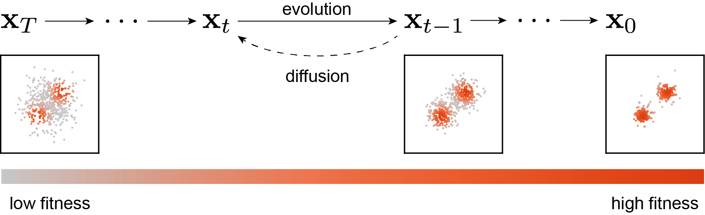
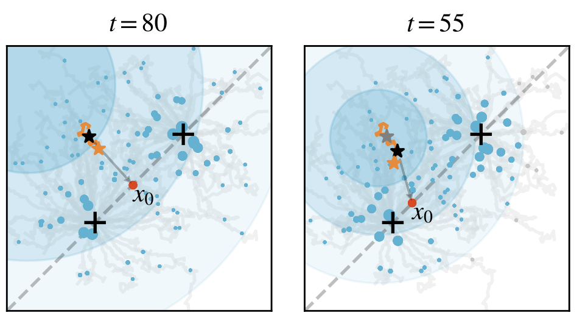
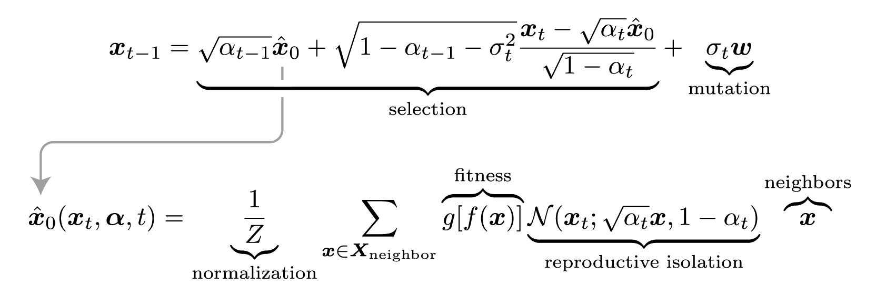
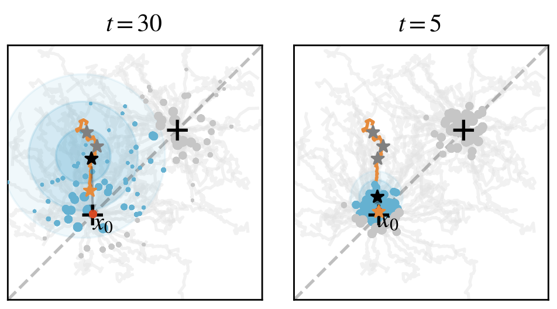

Connecting two fields always brings some wonderful experiences. On one hand, seemingly disparate theories can be unified, and developments in one field can promote the other. On the other hand, you can transform a problem into another form, making it easier to solve. For example, the problem of a "smoothly moving ball" might be easier to solve under the Hamiltonian mechanics framework.

Optimization and generation are one such pair, with a deep connection between them. Physicists have long discovered the relationship between energy and probability, and conveniently linked it to temperature—the higher the energy, the lower the probability. Sampling and generation problems can also be converted into an energy form:

$$
p\propto e^{-\frac{E}{T}}
$$

The Hopfield network, designed by recent Nobel laureate Hopfield, is one example—by learning the data distribution, it obtains an energy function, which can then be used to generate new data or perform inference.

For the recently popular diffusion models, there has been some work using them for optimization tasks. For instance, using pre-trained diffusion models to directly optimize neural network weights or performing multi-objective evolution with them. However, these works often have a touch of "human intervention"—relying on training and design to turn diffusion models into optimization algorithms. Given the flexibility of neural networks, the "diffusion model" component in these works doesn't carry as much weight—other generative models could also be used.

But then again, diffusion models are indeed inextricably linked with evolution and optimization, especially with evolution. Let's break it down: First, evolution consists of two parts. One is directed natural selection, and the other is random variation. Diffusion models are just like this, containing directed denoising and random noise. In the DDPM framework, each iteration is a combination of the two:

$$
x_{t-1}=\underbrace{\sqrt{\alpha_{t-1}}\frac{x_t-\sqrt{1-\alpha_t}\epsilon_\theta(x_t,t)}{\sqrt{\alpha_t}} + \sqrt{1-\alpha_{t-1}-\sigma_t^2}\epsilon_\theta(x_t,t)}_{\text{Directed Denoising}}+\underbrace{\sigma_t w}_{Random Variation}
$$

The first two parts are the deterministic, directed denoising process, while the latter is the random variation. Not only that, but the philosophy of diffusion models is also very similar to evolution: step-by-step optimization, repeated iteration, ultimately leading to rich, meaningful content. From this perspective, the denoising process of diffusion models seems to be evolution, while the reverse evolution is precisely the noising process of diffusion models:

Does this connection truly exist? Does it have a solid mathematical foundation, or is it just an intuitive similarity? To genuinely link these two fields, we need two keys.

## Two Keys to Connect Diffusion and Evolution

The **first key** needs to link probability with fitness. We know that diffusion models learn the probability distribution of training data and then sample data that conforms to this distribution. The process of evolution selects individuals with higher fitness, making them more likely to produce offspring. Analogous to the relationship between probability and energy, we can assume a mapping function $g$ exists that maps the fitness $f(x)$ of an individual $x$ to a probability, i.e., $p(x_0=x)=g[f(x)]$. This step is not too difficult, and there are many optional mapping functions, such as $\exp(-f(x)/T)$, etc.

The **second key** is to link denoising with natural selection, which is slightly more difficult. In diffusion models, the training data $x_0$ is noised to become $x_t=\sqrt{\alpha_t}x_0+\sqrt{1-\alpha_t}\epsilon$. The neural network then needs to predict the added noise $\epsilon$ based on $x_t$. On the other hand, in evolution, each individual $x^{(i)}$ has its corresponding fitness $f(x^{(i)})$. The logic of evolution is to let the fittest individuals produce offspring based on their current fitness. In other words, **evolution seems to be "predicting" the optimal individuals**. This "optimal" corresponds to the origin $x_0$ in diffusion models.

Coincidentally, new perspectives have been proposed in works like DDIM and Consistency Models: diffusion models are also predicting the origin. Returning to the noising process of diffusion models, as long as we know the noise, we can directly calculate the origin:

$$
x_t=\sqrt{\alpha_t}x_0+\sqrt{1-\alpha_t}\epsilon\to x_0=\frac{x_t-\sqrt{1-\alpha_t}\epsilon}{\sqrt{\alpha_t}}
$$

Thus, the second key is also unlocked, and denoising and natural selection can be connected. The final question is how to combine these things.

## Bayesian Method: Diffusion Evolution Algorithm

The key to the problem remains the second key. Ultimately, whether it's a diffusion model or an evolutionary algorithm, what we need is a prediction model—given $x_t$, predict $x_0$, written in probabilistic form as $p(x_0=x|x_t)$. Earlier, we assumed that diffusion equals reverse evolution, and evolution equals reverse diffusion. This "reverse thinking" easily brings to mind Bayes' theorem:

$$
p(\bm x_0=\bm x|\bm x_t)=\frac{\overbrace{p(\bm x_t|\bm x_0=\bm x)}^{\mathcal N(\bm x_t;\sqrt{\alpha_t}\bm x,1-\alpha_t)}\overbrace{p(\bm x_0=\bm x)}^{g[f(\bm x)]}}{p(\bm x_t)}
$$

Coincidentally, the two probabilities in the numerator are easy to calculate. $p(x_0=x)$ was given earlier, and $p(x_t|x_0=x)$ is very straightforward—since $x_t=\sqrt{\alpha_t}x_0+\sqrt{1-\alpha_t}\epsilon$, it is a Gaussian term and not difficult to obtain.

Back to the training of diffusion models, they all use the MSE loss:

$$
\mathcal L=\mathbb E_{x_0\sim p_\text{data}} \|\epsilon_\theta(\sqrt{\alpha_t}x_0+\sqrt{1-\alpha_t}\epsilon,t)-\epsilon\|^2
$$

Since this is the case, our final prediction for $x_0$ is a simple weighted average:

$$
\hat{{x}}_0({x}_t, {\alpha},t)=\sum_{{x}\sim p_\text{eval}({x})}  p({x}_0={x}|{x}_t){x}=\frac{1}{Z}\sum_{{x}\in X_t} g[f({x})]\mathcal N({x}_t; \sqrt{\alpha_t}{x}, 1-\alpha_t){x}
$$

Then, by applying the DDIM iteration framework, we immediately get:

$$
x_{t-1}=\sqrt{\alpha_{t-1}}\hat x_0+\sqrt{1-\alpha_{t-1}-\sigma_t^2}\frac{x_t-\sqrt{\alpha_t}\hat x_0}{\sqrt{1-\alpha_t}}+\sigma_t w
$$

This gives us the "Diffusion Evolution Algorithm." Here's a simple example to show its evolutionary process. Assume a 2D space where the fitness is highest near two points (indicated by a plus sign +). At the beginning (t=80), each individual is randomly initialized and scattered across the space:

We randomly select a point, which then considers two questions: First, which neighbor has a higher fitness? Second, which neighbor is closer to me? Combining the answers to these two questions, it estimates its own origin $x_0$ and takes a small step in that direction, then adds a bit of noise.

This repeats, and as evolution progresses, $\alpha_t$ becomes larger—each individual becomes more focused on its immediate neighbors:

Eventually, the population splits into two groups, each arriving at one of the two optimal points.

Here, $\alpha_t$ corresponds to reproductive isolation—individuals only "learn" from neighbors similar to themselves. The individual won't consider a very different, high-fitness "stranger." From the perspective of diffusion models, reproductive isolation precisely brings diversity, which in biology corresponds to an "ecological niche." A population won't compete with all organisms, but will only interact with the populations directly relevant to it. The diffusion model provides a new perspective on biodiversity and links to "novelty search / quality diversity search."

## A Free Lunch: Standing on the Shoulders of Diffusion Models

As mentioned at the beginning, connecting two fields simplifies many problems—you can transform a problem into another form, making it easier to solve. The same is true here; we can stand on the shoulders of diffusion models and use their tools to optimize evolutionary algorithms.

The first example is **accelerated sampling**. The most time-consuming part of an evolutionary model is calculating fitness, so we always hope to reduce the number of iterations. Coincidentally, accelerated sampling is also an important topic for diffusion models. Here, for convenience, we use a simple trick: changing $\alpha_t$ to a cosine form instead of the default DDPM form. This one change alone gives us an accelerated evolutionary algorithm—it can achieve in 10-20 steps what previously required 100 steps. We tested this method on some 2D problems, and the effect was very significant:

The second example is the **latent space evolutionary algorithm**. We are certainly not satisfied with 2D problems, so we tried using the diffusion evolution algorithm to train a neural network to control a cart and keep a pole on it upright. This neural network needs four inputs, corresponding to the cart's state, and two outputs to control the cart's left-right movement. Assuming there's an 8-dimensional hidden layer, 58 parameters are needed.

However, the original diffusion evolution algorithm performed poorly and had difficulty finding good results. We suspected this was a problem caused by dimensionality. Diffusion models have a similar issue; many people have found that DDPM works well on images below 64x64, and the quality decreases for larger ones. Therefore, Stable Diffusion introduced latent space diffusion models—encoding images into a low-dimensional space, with the diffusion model only sampling this low-dimensional latent space, and finally using a decoder to restore the image:

We used a similar method to map the evolutionary task to a latent space, thus solving the high-dimensional problem. The difficulty here lies in the encoder and decoder—obviously, we don't know the distribution of $x_0$ in advance, so training an encoder is out of the question. However, we found that a random linear encoder was good enough and didn't require pre-training. The decoder could even be skipped. This gives us the "latent space diffusion evolution algorithm":

$$
\hat x_0(x_t, \bm\alpha,t)=\sum_{x\sim p_\text{eval}(x)}  p(x|x_t)x=\frac{1}{Z}\sum_{x\sim p_\text{eval}(x)} g[f(x)]{\color{teal}\mathcal N(z_t; \sqrt{\alpha_t}z, 1-\alpha_t)}x
$$

where $z=Ex$ and $E_{ij}\sim\mathcal N^{(d,D)(0,1/D)}$.

Compared to the traditional CMA-ES, we can solve the cart-pole balance problem within 10 steps:

And this algorithm can even be directly extended to tens of thousands of dimensions and still work.

## What is the Solution to the Equation?

To summarize, I think a table can be made to correspond diffusion models with evolutionary algorithms:

| Diffusion Models | Evolutionary Algorithms |
| --- | --- |
| Diffusion process $x_t=\sqrt{\alpha_t}x_0+\sqrt{1-\alpha_t}\epsilon$ | Gaussian term / Reproductive isolation |
| MSE loss | $\hat x_0$ uses a weighted average |
| DDPM / DDIM sampling process | Diffusion evolution iteration process |

As can be seen, every key part corresponds one-to-one. This leads to our final question: diffusion models are already a family, and diffusion evolution algorithms will also have many types. Can other diffusion models lead to interesting evolutionary algorithms? At the same time, evolutionary algorithms have a long history and also have many elegant and concise tools. Can evolutionary algorithms, in turn, optimize diffusion models? Returning to the initial question, there is one more hidden benefit to connecting the two fields: we can "solve the equation." When $x^2=-1$ was written, people created imaginary numbers. By analogy, what can be solved by the equation of diffusion models and evolutionary algorithms?