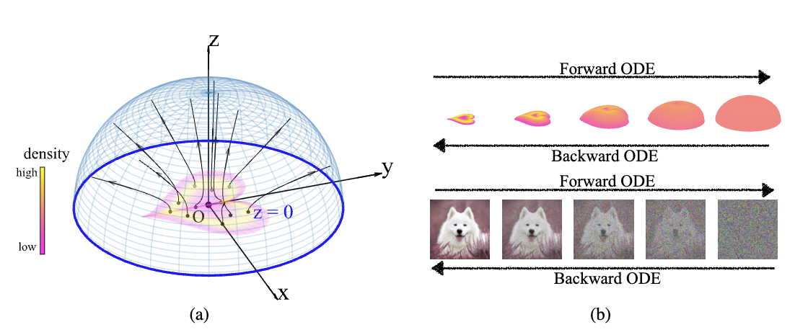
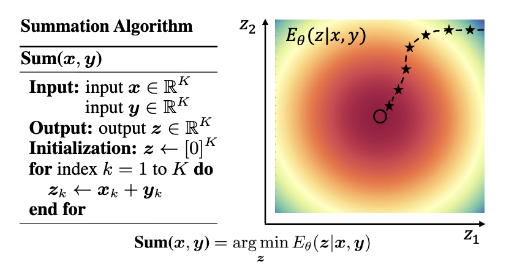

回顾近几年人工智能的发展，扩散模型（Diffusion Model）和 Transformer 无疑是两项里程碑式的工作。值得注意的是，这两项技术的核心直觉均源自 AI 领域之外：扩散模型借鉴了非平衡态统计物理中关于粒子扩散与逆扩散的研究，而 Transformer 赖以成名的注意力机制，则直接对应着人类认知心理学中的选择性关注过程。

如果我们进一步审视历史，会发现这种「外部启发」并非孤例。生成对抗网络（GAN）将博弈论引入生成过程，构建了一个生成器与判别器的对抗系统；残差网络（ResNet）的有效性，则可以在数学上被视作常微分方程（ODE）离散化的结果。基于这些观察，我认为有必要提出一个区别于当下的新视角——**Science for AI**。

目前，学界更热衷于讨论 AI for Science。无论是 AlphaFold 在蛋白质结构预测上的突破，还是 AI Feynman 在物理方程发现上的应用，这些知名工作的范式通常是一致的：将机器学习视为一种高维统计工具，去处理科学领域的数据。我并不否认这种工具视角的价值，但它存在局限性：它主要利用了 AI 的拟合能力，却忽略了科学领域自身积累了数百年的结构性洞察、忽略了科学领域中大量的优良性质。

Science for AI 主张的是一种反向的路径：**利用科学领域中已经经过验证的、具有良好性质的数学结构，来研究智能。**

我们不妨先看几个具体的案例，它们展示了自然科学的直觉是如何投射在智能之上的。

首先是 2022 年发表的 **Poisson Flow Generative Models**。这项工作利用了静电学中一个非常基础的物理现象：泊松方程。在静电场中，无论电荷（数据点）的分布多么复杂，电场线都具有非相交的性质。更重要的是，如果我们观察的位置距离电荷足够远，任何复杂的有限电荷分布在远处看起来都像是一个均匀的球对称分布。PFGM 利用了这一性质：它将数据视为电荷，只要我们在「无穷远」的一个均匀球面上采样，然后沿着电场线逆流而上，就能精确地映射回复杂的原始数据分布。这里，物理学提供了一种将简单分布（均匀球面）映射为复杂分布（图像数据）的天然几何路径，而这正是生成模型的本质。

另一个例子是**基于能量的模型（Energy-Based Model, EBM）**。在物理学中，一个系统的稳定状态往往对应着「自由能」（Free Energy）的极小值。自由能由两部分组成：势能（系统的能量状态）与熵（系统的混乱程度），并在温度的调节下达到平衡。EBM 将这一思想引入 AI，不仅用于生成，更将推理（Inference）过程重新定义为能量最小化的过程。这与认知科学中的「自由能原理」（Free Energy Principle）——即生物智能倾向于最小化意外惊奇（Surprise）——形成了某种数学上的同构。

第三个例子来自我自己的研究：[Diffusion Models are Evolutionary Algorithms](https://openreview.net/forum?id=xVefsBbG2O)。我们观察到，扩散模型的去噪过程（Denoising）在数学上可以拆解为两部分：一个确定性的、向数据流形移动的「漂移项」，以及一个随机的「噪声项」。这与生物演化过程惊人地相似：确定性的漂移对应着自然选择（筛选出适应环境的特征），而随机噪声则对应着基因变异。基于此直觉，我们证明了扩散模型在数学形式上等价于一种演化算法。这一转化不仅让我们在公式中看到了类似「生殖隔离」的机制，更提供了一种无需反向传播训练的演化视角。

为什么这些科学直觉能如此有效？科学哲学家汉斯·赖欣巴哈（Hans Reichenbach）提出的区分或许能解释这一过程。他将科学活动分为 **「发现的语境」（Context of Discovery）与「辩护的语境」（Context of Justification）** 。前者指科学家获得新知时的心理过程，往往充满直觉、猜测甚至是非理性的灵感；后者则是用逻辑和数学对这些发现进行严格证明和形式化的过程。Science for AI 正是利用其他科学领域的成熟结构作为「发现的语境」，获取关于智能的直觉，随后在 AI 的工程实践中完成「辩护的语境」。

这正是类比的力量。认知科学家侯世达（Douglas Hofstadter）在《表象与本质》（*Surfaces and Essences*）中提出，类比并非仅仅是修辞手法，而是人类认知的核心燃料（Fuel and Fire）。我们将物理或生物系统中运作良好的结构（源域），通过类比映射到人工智能的算法设计中（目标域）。这并非简单的模仿，而是假设不同领域的科学背后，可能共享着同一套数学结构——就像柏拉图洞穴寓言中的投影，物理学和 AI 也许只是同一个「数学实体」在不同侧面投下的影子。

从这个角度来看，Science for AI 是对 Rich Sutton 著名文章 《苦涩的教训》（[The Bitter Lesson](http://www.incompleteideas.net/IncIdeas/BitterLesson.html)） 的一种回应与修正。

Sutton 在文中回顾了 AI 七十年的历史，提出了一个令人沮丧但有力的观点：利用算力进行搜索和学习，总是比利用人类知识更有效。他认为，研究者倾向于根据自己对思维的理解（例如围棋的定式、语言的语法规则）来设计 AI，这种做法在短期内有效，但长期来看，总是会被那些仅仅利用海量算力和通用方法的系统所超越。因为人类的内省往往是带有偏见的、难以规模化的。

Sutton 的观点在涉及「人类经验」时是正确的，但我认为他忽略了另一种知识来源。

Science for AI 引入的不是主观的「人类经验」，而是客观的「科学结构」。 物理定律和演化机制并非人类的主观发明，而是经过亿万年验证的宇宙运行机制。将这种结构引入 AI，与手动编写围棋规则有着本质的区别。我们不是在教 AI 怎么下棋，而是赋予它一个符合自然规律的「大脑结构」。

这种类比可以分为三个层级：

1. **现象级（Phenomenological Level）**：模仿表象。如看到鸟飞就尝试制造扑翼机。这往往止步于表层，难以触及智能本质。
2. **机制级（Mechanism Level）**：这是我认为 Science for AI 最重要的切入点。在这一层级，我们关注的是演化算法、统计物理、场论等。它们既不像现象级那样肤浅，也不像第一性原理那样抽象。它们拥有严谨的数学结构，有良好的性质，解释了系统为何具有适应性，同时又是可计算、可实践的。这是连接科学直觉与工程实现的最佳桥梁。
3. **第一性原理级（First Principles Level）**：追求最底层的解释。例如基于柯尔莫哥洛夫复杂度的所罗门诺夫归纳（Solomonoff Induction）。这虽然在理论上解释了通用智能，但由于涉及不可计算项和无穷大的搜索空间，极难直接工程化。

对于 Science for AI，我认为机制级别是最重要、最丰饶的层级。

在科学中，「美」往往意味着高度的「压缩」与「统一」。麦克斯韦方程组之所以美，是因为它用四个公式压缩了所有的电磁现象；物理学的大一统理论之所以迷人，是因为它试图用一种结构解释万物。

AI for Science 是一种实用主义的探索，而 Science for AI 则带有一种审美的必然性。智能的产生不应是杂乱无章的工程堆砌，而应遵循某种简洁、普适的数学结构。从这个意义上说，Science for AI 不仅是为了构建更强的 AI，也是为了在人工智能的构造中，重新发现那套在物理和生物世界中普遍存在的、关于智能的同构之美。