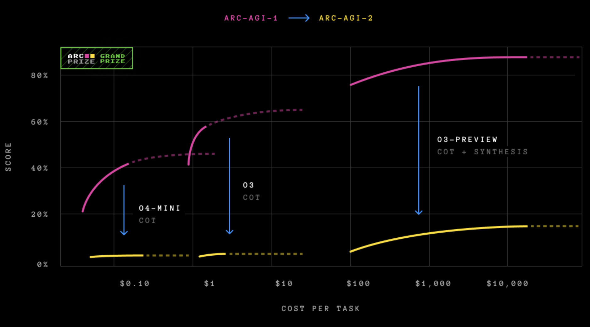

时间行至 2025 年底，那个曾被视为遥远科幻概念的「通用人工智能」（AGI），如今已不再是空谈，而是成为了摆在每个人案头沉甸甸的现实。

在这个时代，我们目睹了两种截然不同的情绪。一边是深沉的忧虑与克制。图灵奖得主 Geoffrey Hinton 对 AGI 表达了深切的恐惧，甚至坦言后悔自己的研究，担心失控的智能将毁灭人类；而传奇人物 Ilya Sutskever 更是为了追求根本上的安全，毅然建立 SSI（Safe Superintelligence），踏上了一条孤独的道路——去构建一个从根本上安全、可控的超级智能。另一边则是狂热的**有效加速主义（e/acc）**。他们高呼「加速」，主张不惜一切代价推进技术奇点，坚信算力与智能的指数级爆发将是解决人类所有顽疾的终极解药，任何减速行为都是对文明的犯罪。

然而，在这些关于算力竞赛、安全控制与社会伦理的喧嚣讨论之下，人工智能领域其实一直埋藏着一条草蛇灰线的「暗线」。这条线索早在 40 多年前就已存在，它无关当下的 GPU 集群，也不谈论 Transformer 的层数，而是用最纯粹的数学语言，定义了「智能」的本质。

这条暗线，始于图灵（Turing），成于柯尔莫哥洛夫（Kolmogorov），并在雷·所罗门诺夫（Ray Solomonoff）手中汇聚成一座灯塔。今天，让我们暂时从 2025 年的纷扰中抽身，沿着 Ilya Sutskever 那句著名的「压缩即智能」回溯，去重新发现那座被现代 AI 遗忘的数学宝藏——所罗门诺夫通用归纳（Solomonoff Induction）。

## 一、智能的本质：从压缩到预测

### 压缩=寻找规律

让我们先回到传奇人物 Ilya Sutskever 身上。在 2023 年的一次讲座中，Ilya 抛出了一个在当时引起轰动的观点：「智能即压缩」。

这个想法听起来简洁得令人意外，但其背后蕴含着深刻的逻辑：为了压缩大规模的语言数据，或者任何形式的数据，你必须寻找到其中蕴含的规律。你的规律找得越准确、越简单，你就越能够极致地压缩数据。而「寻找规律」的过程，恰恰就是建模的过程。

我们可以想象一个确定性的世界，大语言模型（LLM）的任务是尽可能准确地预测下一个 token。如果在这个世界里，「下一个 token」是完全没有随机性的，那么一个完美的模型不仅能准确预测未来，也能完美地压缩过去——你只需要给出一段极短的提示词（Prompt），模型就能利用它所掌握的规律，精准地还原出整篇文章。

事实上，早在 2016 年，OpenAI 内部就已经萌生了这种思想的雏形。但很多人不知道的是，如果从「压缩即智能」这一概念继续上溯，我们会发现它连接着算法信息论的三位祖师爷：Hutter 的 $AI\xi$、所罗门诺夫的通用归纳，以及大名鼎鼎的 Kolmogorov。

### 时间序列：万物的统一视角

为了真正理解这套理论，我们需要打破传统机器学习中「训练」与「推理」泾渭分明的界限。在生物智能中，观察、学习与预测是交织在一起的流。为了描述这种过程，我们必须引入时间 $t$，构建一个统一的图像：**一切智能活动，本质上都是基于过去的观测 $x_{1:t}$，来预测下一时刻 $x_{t+1}$。**

在这个框架下，$x_{1:t}$ 就是我们所有的「经验」。这个 $x_t$ 的形式极其灵活：它可以是一串数字，那么你在做时间序列预测；它可以是一张图像的像素流，那么你在做生成式建模；它甚至可以是「图像-标签」的配对序列，给定图像 $x_t$，去预测标签 $x_{t+1}$，那么你就在做分类任务。

由此可见，这种抽象的时间序列视角，实则蕴含了机器学习中的万千法门。而所有任务的核心，都归结为一个条件概率：

$$

p(x_{t+1} \mid x_{1:t}) = \frac{p(x_{1:t+1})}{p(x_{1:t})}
$$

这个公式告诉我们，要预测未来（$x_{t+1}$），本质上等同于要能够评估整个序列（$x_{1:t+1}$）发生的概率。换句话说，谁能最准确地计算出一段数据出现的**先验概率**，谁就掌握了预测未来的钥匙。

### 奥卡姆与伊壁鸠鲁的博弈

既然目标明确，那我们该如何预测？让我们玩一个简单的「找规律」游戏。假设有这样一串数字：

$$

1, 0, 1, 0, 0, 1, 0, 0, 0, 1, \dots
$$

如何预测下一个数字？在这个问题面前，人类的直觉往往会分裂成三种哲学态度：

第一种是**奥卡姆剃刀（Occam's Razor）**。这是人类直觉的首选。你会敏锐地发现「两个 1 之间的 0 每次增加一个」这个简单的规律。根据这个规律，接下来应该是四个 0，然后是 1。我们偏爱它，因为它**简单**。

第二种是**不可知论（或者说是阴谋论）**。你可以争辩说，这串数字只是从一个更大的、完全不同的序列中截取的片段。也许在下一个数字之后，规律会突变，变成全都是 1。虽然这听起来很别扭，但在数据出现之前，你无法从逻辑上证伪它。

第三种是**纯粹的随机性**。也许这是一串完全随机的数字，之前的规律纯属巧合，就像看着云彩像一只羊一样，只是我们的错觉。

这就引出了古希腊哲学家伊壁鸠鲁（Epicurean）的**「多重解释原则」**：「凡经验允许多种解释者，皆当并存，而非独断。」这意味着，虽然我们偏爱简单的解释（奥卡姆），但我们不能武断地抛弃其他复杂的可能性，除非新的证据彻底否定了它们。

这似乎是一个两难的困境：奥卡姆剃刀要求我们只选最简单的，而伊壁鸠鲁要求我们保留所有的。如何将这两者统一起来？

> *「那些只执一种解释的人，是在与事实相冲突的。」*—— Diogenes Laertius《哲学家列传》第十卷 - 致皮托克勒书 -伊壁鸠鲁

所罗门诺夫归纳，正是这两个看似矛盾的原则在数学上的完美联姻。

## 二、数学的神谕：从算法概率到通用归纳

要理解所罗门诺夫的伟大之处，我们不能简单地认为他是一个把哲学翻译成公式的翻译官。恰恰相反，他是一个探索者。他试图回答一个最根本的问题：**在这个宇宙中，一段数据 $x$ 出现的先验概率到底是多少？**

如果我们能算准这个先验概率（记为 $M(x)$），根据贝叶斯公式，我们就能完美地预测未来。雷·所罗门诺夫并没有凭空设计一个公式，而是从一个思想实验出发，推导出了那个惊人的结论。

### 算法概率 $M$：猴子与打字机的数学真相

让我们想象那个著名的场景：一只猴子在键盘上随机敲打。但在所罗门诺夫的版本里，猴子敲的不是诗句，而是**二进制代码**，输入给一台通用的图灵机。

如果不做任何假设，我们唯一知道的真理是：**程序的生成服从随机过程。**为了数学严谨，我们需要引**入前缀码（Prefix-free Code）**的概念（即机器读到一段完整代码就会停机执行，不会读成另一段代码的前缀）。如果猴子随机且独立地敲击 0 或 1，那么一个长度为 $|p|$ 的特定程序被敲出来的概率，精确地等于 $2^{-|p|}$。

现在，我们要问：这只猴子敲出的程序，运行后输出结果恰好是数据 $x$ 的概率是多少？

显然，这是所有能够输出 $x$ 的程序概率之和，我们称之为**算法概率（Algorithmic Probability）**，记为 $M(x)$：

$$

M(x) = \sum_{p:U(p)=x} 2^{-|p|}

$$

这里出现了一个并非人为设计的、而是数学上必然的结果：**由于这是一个 $2$ 的负指数求和，总和的数值将由那个最短的程序主导。**

这就引入了**柯尔莫哥洛夫复杂度 $K(x)$**——即输出 $x$ 的最短程序长度。

$$

K(x) := \min_{p} \{ |p| : U(p) = x \}

$$

举个例子，假设生成数据 $x$ 的最短程序长度是 100 位，次短的是 200 位。$2^{-100}$ 是 $2^{-200}$ 的 $2^{100}$ 倍！后面那些冗长、复杂的程序，对总概率的贡献微乎其微。

因此，我们得到了一个震撼的近似：

$$

M(x) \approx 2^{-K(x)}
$$

**这正是奥卡姆剃刀的真正来源。** 奥卡姆剃刀并非人类为了省事而发明的主观偏好，它是算法世界的物理定律：**越简单的东西（$K$ 小），被算法随机生成的概率（$M$）就越大。**

简单即真理，不是哲学，是数学。

使用算法概率，我们可以穷举图灵机，估算二维结构的复杂度

### 所罗门诺夫归纳 $\xi$：完美的预测机器

既然既然 $M(x)$ 给了我们数据的先验概率，所罗门诺夫顺水推舟，将其转化为预测模型。

他构想了一个终极预测器 $\xi$。既然我们不知道数据背后到底是哪种规律在起作用，那就把**所有可能的、可计算的概率分布**都拿来，组成一个集合 $\mathcal{M}$。每一个 $\nu \in \mathcal{M}$ 都是一种解释数据的「理论」或「假说」。

那么，怎么给这些理论分配权重呢？所罗门诺夫不需要重新发明轮子，他直接借用了 $M(x)$ 的结论：一个理论 $\nu$（本质上也是一段程序）在宇宙中存在的先验概率，正比于 $2^{-K(\nu)}$。

于是，诞生了**所罗门诺夫归纳（Solomonoff Induction）**：

$$

\xi_U(x_{1:t}) = \sum_{\nu \in \mathcal{M}} w_\nu \nu(x_{1:t}), \quad \text{其中 } w_\nu = 2^{-K(\nu)}

$$

现在，我们可以清晰地看到这个公式并非拼凑，而是逻辑的必然流露：

1. **求和 ($\sum$) —— 伊壁鸠鲁的坚持**：这对应了算法概率中「对所有可能的程序求和」。我们不因为某个理论看起来奇怪就将其剔除，保留所有可能性。
2. **权重 ($2^{-K}$) —— 奥卡姆的胜利**：这并非人为设定的偏好，而是源于前文推导的算法概率。复杂的理论因为其描述程序长，自然而然地被赋予了极低的权重。
3. **贝叶斯更新**：随着数据 $x_{1:t}$ 的累积，$\xi$ 会自动筛选。那些预测错误的理论 $\nu$，其概率项 $\nu(x_{1:t})$ 会迅速归零；而那些**既简单（$2^{-K}$ 大）又准确（$\nu(x)$ 高）**的理论，将在求和中占据主导地位。

### 通用归纳：收敛的必然性

$\xi$ 最强大的地方在于它的**通用性**和**收敛性**。可以说，$\xi$ 和 $M$ 在数学上是殊途同归的（$M(x) \overset{\times}{=} \xi(x)$）。这意味着，$\xi$ 继承了算法概率的所有性质。数学家已经证明了一个极为重要的收敛定理：

假设环境的真实分布是 $\mu$（只要它是可计算的），那么随着观测数据的增加，所罗门诺夫归纳 $\xi$ 的预测结果，将以极快的速度收敛到真实分布 $\mu$。

$$

\sum_{t=1}^{\infty} \mathbb{E} \left[ \sum_{x_t} \left( \xi(x_t|x_{<t}) - \mu(x_t|x_{<t}) \right)^2 \right] \le K(\mu) \ln 2 + \mathcal{O}(1)

$$

这个不等式告诉我们：**预测的总误差是有上限的**，这个上限仅取决于环境本身的复杂度 $K(\mu)$。

这就意味着，**所罗门诺夫归纳是理论上最优的学习机器。** 它不需要我们在神经网络架构、超参数上纠结，只要给它足够的数据，它就能自动找到隐藏在数据背后的那个「真实生成程序」，无论这个程序是牛顿力学，还是相对论，亦或是一套我们要到 3000 年才能发现的物理定律。

这就是**通用归纳（Universal Induction）**。它统一了归纳推理、模型选择和贝叶斯统计，成为了智能在数学上的终极定义。

## 三、现实的倒影：AIXI、大模型与科学的尽头

虽然 $\xi_U$ 和 $K(x)$ 包含了不可计算的成分，如同柏拉图理念世界中的完美原型，无法在物理世界直接构建。但如果我们观察 2025 年的 AI 进展，会发现许多突破性技术，其实都是这套理论在现实洞穴墙壁上的投影。

### 终极智能体 AIXI：从预测到决策

掌握了完美的预测工具 $\xi_U$，我们距离 AGI 只差最后一步：**决策**。

如果我们给 $\xi$ 加上一个目标（Reward），就诞生了理论上最强的通用强化学习智能体——**AIXI**。其决策公式如下：

$$

y_t := \arg\max_{y_t} \sum_{x_t} \dots \max_{y_n} \sum_{x_n} [r_t + \dots + r_n] M(x_{1:n} \mid y_{1:n})

$$

这个公式描述了 AIXI 的思考过程：它利用通用分布 $M$ 来模拟未来所有可能的观测分支，预测在不同行动序列下，环境会如何反馈，然后选择那个能让未来累积奖励期望值最大的动作。AIXI 是智能的数学上限，它告诉我们：**智能 = 强大的压缩、预测模型 + 奖励最大化策略**。

### 压缩即学习：ARC-AGI 与 VAE 的本质

现实中，我们无法计算 $K(x)$，但我们一直在寻找它的**近似解**。

ARC-AGI 任务对于很多 LLM 来说仍然极为困难

Keras 之父 François Chollet 提出的 ARC-AGI 测试，因其极少的样本量和极高的推理难度，成为了检验 AI 是否具备「通用性」的试金石。传统的深度学习依赖海量数据，面对 ARC 往往束手无策。然而，基于「压缩」思想的方法却异军突起。

一个 ARC-AGI 任务

为了理解这一突破，我们需要回溯到一开始提到的那个「时间序列」的统一视角。

在 ARC 任务中，我们通常有几对示例（输入 $x$ 和输出 $y$），以及一个新的测试输入 $x_n$，目标是预测 $y_n$。如果我们把这个过程看作一个随时间流动的序列，那么现在的「历史数据」就是：

$$

D = (x_1, y_1, x_2, y_2, \dots, x_{n-1}, y_{n-1}, x_n)

$$

我们的任务，本质上就是预测序列的下一个元素 $y_n$。

利用所罗门诺夫归纳的框架，要预测 $y_n$，我们实际上是在寻找一个能最好地生成当前历史序列 $D$ 的理论 $\nu^*$*。*根据前文推导的公式，最优的理论 $\nu^*$ 必须同时满足两个条件：**解释力强（概率大）且足够简单（复杂度低）**。我们套用 $\xi_U$ 的公式，但为了简单，只寻找最优的那个 $\nu^*$*：*

$$
\nu^* = \arg\max_\nu \underbrace{2^{-K(\nu)}}_{\text{简单性}} \cdot \underbrace{\nu(D)}_{\text{解释力}}
$$

为了方便计算，我们对等式两边取负对数。原本的「最大化概率」问题，瞬间变成了一个我们熟悉的「最小化损失」问题：

$$
\text{Loss} = \underbrace{-\log_2 \nu(D)}_{\text{重构误差}} + \underbrace{K(\nu)}_{\text{模型复杂度}}
$$

看！这不仅仅是数学变换，这是物理意义的显现：

1. **第一项 $-\log_2 \nu(D)$**：这是**重构误差**。如果你的理论 $\nu$ 很糟糕，它就很难还原出历史数据 $(x_1, y_1 \dots)$，这项数值就会很大。
2. **第二项 $K(\nu)$**：这是**模型复杂度**。我们不仅要求模型能拟合数据，还要求模型本身的描述（代码长度或参数量）尽可能短。

两者加起来，恰恰就是**最小描述长度（MDL）。**

现在，让我们把目光投向现代生成模型——**变分自编码器（VAE）**。惊人的是，VAE 的损失函数（ELBO 的负值）几乎完美地复刻了这个结构：

- **Reconstruction Loss**：对应第一项，要求模型能准确还原输入数据。
- **KL Divergence**：对应第二项，约束隐变量的分布，本质上就是对模型复杂度的正则化项。

**CompressARC** 等前沿工作正是利用了这一点。它们不把 ARC 看作普通的分类问题，而是看作一个**序列压缩问题**。模型试图找到一个极其精简的潜在程序（$z$），这个程序不仅能无损压缩（重构）所有的训练示例，还能自然地延伸到 $x_n$，从而「生成」出 $y_n$。

随着训练的深入，模型的描述长度逐渐降低，而预测也越来越符合要求。

这强有力地证明了 Ilya 的论断：**学习的本质，就是在做有损压缩。** 当你把一系列数据压缩到极致，剩下的那个「压缩包」（程序），就是智能本身。

### 灾难性遗忘的解药：求和的力量

所罗门诺夫归纳还为当今大模型的一个顽疾——灾难性遗忘，提供了理论解药。

在传统的模型训练中，我们通常只保留一个最优模型（参数组），这相当于我们只保留了 $\mathcal{M}$ 中概率最大的那个 $\nu^*$。然而，$\xi_U$ 的定义是 $\sum_{\nu}$。**抛弃求和，是灾难性遗忘的根源。**

当我们只保留一个模型时，面对新数据，如果新旧数据冲突，我们被迫修改参数，从而破坏了对旧数据的记忆。但在 $\xi_U$ 的框架下，如果新数据出现，我们只是重新计算不同理论 $\nu$ 的**权重**。旧的理论可能解释不了新数据，权重下降，但它依然存在；新的理论（可能更复杂）权重上升。

这解释了为什么 **Ensemble Methods（集成方法）** 和 **MoE（混合专家模型）** 如此有效。MoE 通过冻结部分专家、激活新专家，模拟了在不同理论间切换的过程。它保留了多种「解释世界的路径」，而非强行将世界压缩进单一的参数路径中。

### 科学共同体：人类就是 AGI

最后，如果我们将视野拉大，会发现整个人类科学发展的过程，本身就是一个巨大的 AGI 在运行所罗门诺夫归纳。

我们可以把科学界看作一个整体：

- **$\mathcal{M}$ (理论池)**：每一位科学家提出的假说、理论，都是 $\mathcal{M}$ 中的一个 $\nu$。
- **$x_{1:t}$ (数据)**：人类历史上观测到的所有实验数据。
- **学术机制**：我们鼓励创新（提出新的 $\nu$），同时奖励准确性（$\nu(x)$ 高）。

科学哲学家托马斯·库恩提出的「范式转换（Paradigm Shift）」，在数学上有了完美的对应。在反常数据（如水星近日点进动）出现前，牛顿力学作为一个极其简单（$K$ 小）且相当准确的理论，拥有极高的权重。当反常数据出现，牛顿力学的预测概率 $\nu(x)$ 下降。此时，广义相对论虽然更复杂（$K$ 大，初始权重低），但它能完美解释新数据。根据贝叶斯更新，相对论的权重逐渐超过牛顿力学，完成了范式转换。

从这个角度看，人类群体智能的演化，并不神秘，它忠实地遵循着所罗门诺夫写下的公式。

### 结语

在机器学习领域，有一个著名的「没有免费午餐定理」（NFL），声称如果没有先验假设，所有算法在所有问题上的平均表现是一样的。

但所罗门诺夫归纳打破了这个咒语。它拒绝了「所有世界出现的概率都一样」这种均匀假设。它基于一个极其本质的信念：**我们所处的宇宙，是由简单的物理定律（短程序）支配的。**

在这个假设下，偏好简单性的所罗门诺夫归纳，以及它的现实近似者——那些基于 Transformer、使用 SGD 优化的大模型，就是那顿免费的午餐。

站在 2025 年的回望中，Ilya Sutskever 的「压缩即智能」不再是一句口号，而是对这套古老理论的现代回响。当我们惊叹于 AI 的涌现能力时，不要忘记，这一切并非魔法，而是数学。那个关于压缩、预测与复杂度的公式，早已在几十年前，静静地预言了今天的一切。