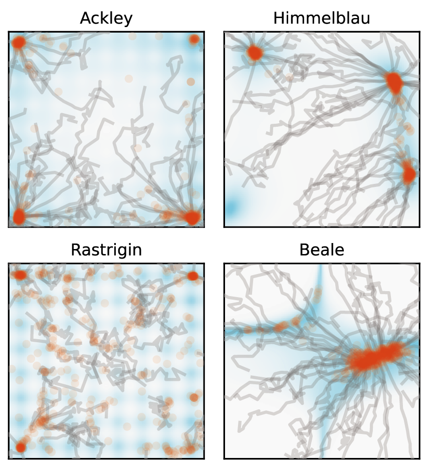
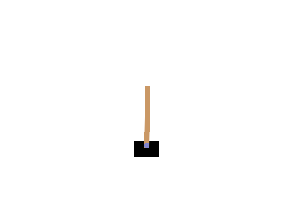
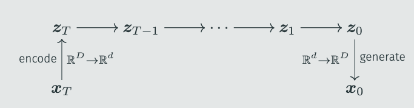
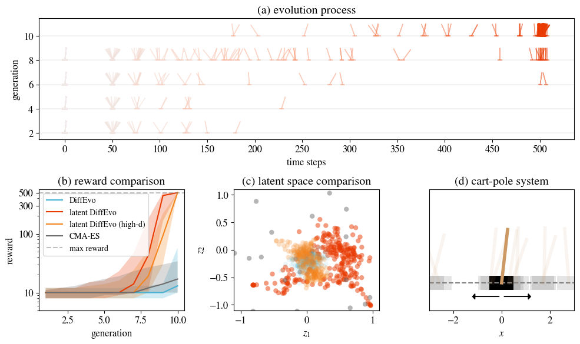

连接两个领域，总会带来一些美妙的体验。一方面，原本看似不同的理论得以统一，两边的发展也可以互相促进。另一方面，你也可以把一个问题转换成另一种形式，使得它更容易解决。就比如「小球光滑运动」的问题，在哈密顿力学体系下可能更容易解决。

优化与生成就是这样一对关系，两者之间蕴含着深刻的联系。物理学家早就发现了能量与概率的关系，还顺便联系上了温度——能量越高，概率越低；采样、生成类问题也可以转化成能量的形式：

$$
p\propto e^{-\frac{E}{T}}
$$

最近的诺贝尔奖得主Hopfield设计的Hopfield网络就是一个例子——通过学习数据的分布，得到一个能量函数，进而可以生成新的数据，或是进行推理。

对于近年来大火的扩散模型，也已经有了一些工作用它们做优化任务。例如利用预训练扩散模型直接优化神经网络权重、用预训练扩散模型进行多目标演化等。然而，这些工作都多少带着点「人为」的痕迹——靠着训练、设计，让扩散模型变成了优化算法。考虑到神经网络之灵活，这些工作中「扩散模型」的权重其实没有那么大——换成别的生成模型也不是不行。

但话又说回来，扩散模型确实和演化、优化有着千丝万缕的联系，特别是和演化的联系。我们一个个来说：首先，演化包含两个部分。一个是有向的自然选择，一个是随机的变异。而扩散模型也正如此，包含了有向的降噪，和随机的噪声。在DDPM的框架中，每一次迭代都是两者的组合：

$$
x_{t-1}=\underbrace{\sqrt{\alpha_{t-1}}\frac{x_t-\sqrt{1-\alpha_t}\epsilon_\theta(x_t,t)}{\sqrt{\alpha_t}} + \sqrt{1-\alpha_{t-1}-\sigma_t^2}\epsilon_\theta(x_t,t)}_{\text{有向降噪}}+\underbrace{\sigma_t w}_{随机变异}
$$

前两个是确定、有向的降噪过程，而后者则是随机的变异。不光如此，扩散模型的理念也和演化非常相似：逐步优化，反复迭代，最终得到丰富、有意义的内容。如此看来，扩散模型的降噪过程似乎就是演化，而逆向的演化，正是扩散模型加噪的过程：

这种联系真的存在吗？它具有坚实的数学基础，还是只有直觉上的相似呢？要真正链接这两个领域，我们需要两把钥匙。

## 连接扩散与演化的两把钥匙

**第一把钥匙**需要链接概率与适应度。我们知道，扩散模型会学习训练数据的概率分布，然后采样出符合概率分布的数据。而演化的过程会选择适应度（fitness）更高的个体，使得它们更容易产生后代。类比概率与能量，我们可以假设存在一个映射函数$g$，将个体$x$的适应度$f(x)$映射为概率，即$p(x_0=x)=g[f(x)]$。这一步的难度不大，可选的映射函数也很多，例如$\exp(-f(x)/T)$，等等。

**第二把钥匙**则需要链接降噪与自然选择，这一步稍微困难一点。在扩散模型中，训练数据$x_0$会加入噪声，变成$x_t=\sqrt{\alpha_t}x_0+\sqrt{1-\alpha_t}\epsilon$。而神经网络则需要根据$x_t$来预测加入的噪声$\epsilon$。另一方面，在演化之中，每个个体$x^{(i)}$都有它对应的适应度$f(x^{(i)})$。而演化的逻辑则是根据当前个体的适应度，让最适应的个体产生后代。换句话说，**演化似乎在「预测」最优的个体**。这个「最优」，对应到扩散模型中，就是原点$x_0$。

恰巧，在DDIM、Consistency Model等工作中都提出了一个新视角：扩散模型也在预测原点。回到扩散模型的加噪过程，只要知道了噪声，我们就可以直接算出原点：

$$
x_t=\sqrt{\alpha_t}x_0+\sqrt{1-\alpha_t}\epsilon\to x_0=\frac{x_t-\sqrt{1-\alpha_t}\epsilon}{\sqrt{\alpha_t}}
$$

如此，第二把钥匙也打通了，降噪与自然选择也能联系起来了。最后的问题就是如何把这些东西组合起来。

## 贝叶斯方法：扩散演化算法

问题的关键仍然在第二把钥匙上。说到底，不论是扩散模型，还是演化算法，我们需要的都是一个预测模型——给定$x_t$，预测$x_0$，写成概率的形式就是$p(x_0=x|x_t)$。前面我们假设扩散等于逆向演化，演化，等于逆向扩散。这种「逆向思维」很容易让人想到贝叶斯公式：

$$
p(\bm x_0=\bm x|\bm x_t)=\frac{\overbrace{p(\bm x_t|\bm x_0=\bm x)}^{\mathcal N(\bm x_t;\sqrt{\alpha_t}\bm x,1-\alpha_t)}\overbrace{p(\bm x_0=\bm x)}^{g[f(\bm x)]}}{p(\bm x_t)}
$$

巧的是，分子里的两个概率都很容易计算。$p(x_0=x)$在前面已经给出，而$p(x_t|x_0=x)$也非常直接——既然$x_t=\sqrt{\alpha_t}x_0+\sqrt{1-\alpha_t}\epsilon$，那它就是一个高斯项，也不难得到。

再回到扩散模型的训练上来，他们用的都是MSE loss：

$$
\mathcal L=\mathbb E_{x_0\sim p_\text{data}} \|\epsilon_\theta(\sqrt{\alpha_t}x_0+\sqrt{1-\alpha_t}\epsilon,t)-\epsilon\|^2
$$

既然如此，我们最终对于$x_0$的预测就是简单的加权平均：

$$
\hat{{x}}_0({x}_t, {\alpha},t)=\sum_{{x}\sim p_\text{eval}({x})}  p({x}_0={x}|{x}_t){x}=\frac{1}{Z}\sum_{{x}\in X_t} g[f({x})]\mathcal N({x}_t; \sqrt{\alpha_t}{x}, 1-\alpha_t){x}
$$

再套用DDIM的迭代框架，我们立刻得到：

$$
x_{t-1}=\sqrt{\alpha_{t-1}}\hat x_0+\sqrt{1-\alpha_{t-1}-\sigma_t^2}\frac{x_t-\sqrt{\alpha_t}\hat x_0}{\sqrt{1-\alpha_t}}+\sigma_t w
$$

如此，就有了「扩散演化算法」（Diffusion Evolution）。这里用一个简单的例子来展现其演化过程。假设有一个二维空间，其中有两个点附近的适应度最高（用加号+表示）。在一开始（t=80），每个个体都随机初始化，散布在空间之中：

我们随机选中一个点，它会考虑两个问题：第一，哪个邻居的适应度更高？第二，哪个邻居离我更近？结合两个问题的答案，它就会估算自身的原点$x_0$，并向这个方向前进一小步，然后再加上一点噪声。

如此反复，随着演化不断进行，$\alpha_t$也越带来大——每个个体也越来越关注自己身边的邻居：

最终，这个种群分成两群，分别抵达了两个最优点。

这里的$\alpha_t$恰好就对应了生殖隔离——个体只会「借鉴」和自己相似的邻居。至于差异很大、适应度又很高的「陌生人」，这个个体也不会考虑。从扩散模型的角度来看，生殖隔离恰恰带来了多样性，这在生物学中还对应了「生态位」。一个种群不会和所有生物发生竞争，而只会和自己息息相关的种群交互，扩散模型为生物多样性给出了新的视角，也和「搜索新颖性」（novelty search / quality diversity search）联系了起来。

## 免费的午餐：站在扩散模型的肩膀上

就如开头所提到的，链接了两个领域之后，很多问题会变得简单——你可以把一个问题转换成另一种形式，使得它更容易解决。在这里也一样，我们可以站在扩散模型的肩膀上，利用扩散模型的工具，优化演化算法。

第一个例子是**加速采样**。演化模型最为耗时的就是计算适应度，因此我们总是希望减少迭代次数。恰巧，加速采样也是扩散模型的重要话题。这里，我们为了方便，使用了一个简单的技巧：将$\alpha_t$变成cosine的形式，而不是DDPM默认的形式。仅此一个改变，就得到了加速演化算法——只需要10～20步，就可以得到之前需要100步的结果。我们在一些二维问题上测试了这个方法，效果非常显著：

第二个例子则是**隐空间演化算法**。我们当然不会满足于二维问题，因此尝试用扩散演化算法训练神经网络，用于控制小车，让车上的木杆保持垂直。这个神经网络需要四个输入，对应车子的状态；同时也要两个输出，用于控制小车左右移动。假设其中有一个维度为8的隐藏层，就需要58个参数。

然而原始的扩散演化算法表现不佳，很难找到不错的结果。我们猜测这是维度引发的问题。而扩散模型也有类似的问题，很多人都发现DDPM在64x64以下的图片上表现很好，再大画质就会下降。因此，Stable Diffusion引入了隐空间扩散模型——将图片编码到低维，然后扩散模型只采样这个低维度的隐空间，最后再用解码器恢复成图片：

我们利用类似的方法，将演化任务映射到隐空间，从而可以解决高维度的问题。这里的难点在于编码器与解码器——很明显，我们预先并不知道$x_0$的分布，训练编码器也就无从谈起。然而，我们发现随机的线性编码就已经足够好了，无需提前训练。而解码器甚至可以直接跳过。这样，就得到了「隐空间扩散演化算法」：

$$
\hat x_0(x_t, \bm\alpha,t)=\sum_{x\sim p_\text{eval}(x)}  p(x|x_t)x=\frac{1}{Z}\sum_{x\sim p_\text{eval}(x)} g[f(x)]{\color{teal}\mathcal N(z_t; \sqrt{\alpha_t}z, 1-\alpha_t)}x
$$

其中$z=Ex$，$E_{ij}\sim\mathcal N^{(d,D)(0,1/D)}$。

相比于传统的CMA-ES，我们可以在10步之内解决小车的平衡问题：

而这个算法甚至可以直接拓展到上万的维度，也一样可以工作。

## 方程的解是什么？

如果要总结一下的话，我觉得可以列出一个表来，将扩散模型与演化算法对应起来：

| 扩散模型 | 演化算法 |
| --- | --- |
| 扩散过程$x_t=\sqrt{\alpha_t}x_0+\sqrt{1-\alpha_t}\epsilon$ | 高斯项 / 生殖隔离 |
| MSE loss | $\hat x_0$使用加权平均 |
| DDPM / DDIM 的采样过程 | 扩散演化的迭代过程 |

可以看到，每一个关键的部分都一一对应。这也引出了我们最后的问题：扩散模型已经是一个家族了，扩散演化算法也会有很多类型。其他的扩散模型能带来有趣的演化算法吗？与此同时，演化算法也有长久的历史，也存在很多简洁优美的工具。演化算法反过来可以优化扩散模型吗？回到最开始的问题上，连接两个领域还有一个隐藏的好处，那就是我们可以「解方程」。列出了 $x^2=-1$，人们便创造了虚数。如此类比，扩散模型与演化算法的方程能解出什么呢？